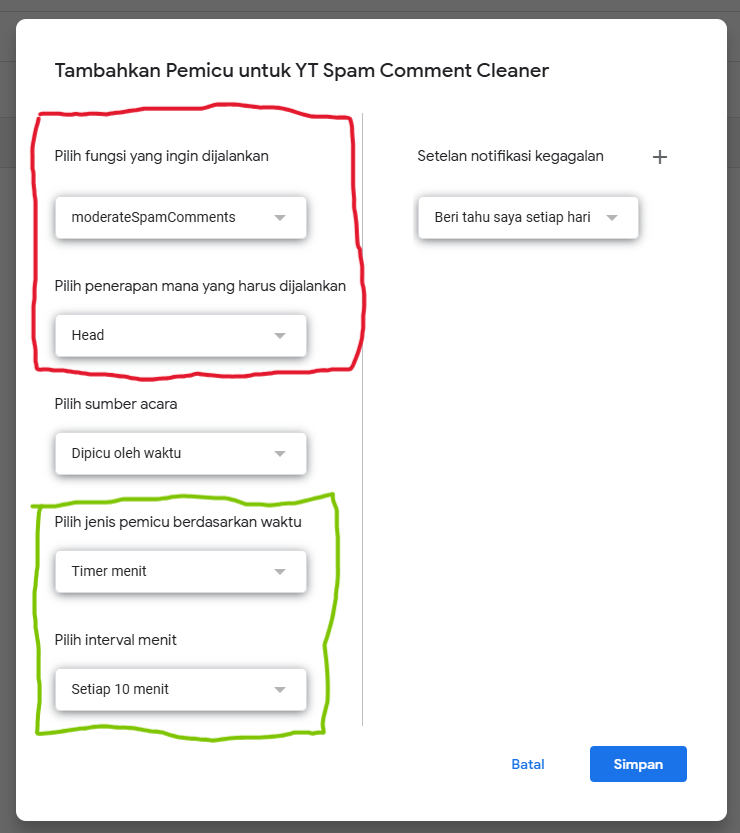

# Pembasmi Spam Judol - YouTube Spam Comment Cleaner

Anda kesal dengan spam judi online yang bertebaran di komentar videomu? Ini solusinya, Alat ini dapat menghapus semua komen judi online di youtube anda secara otomatis.
Tidak perlu hapus manual atau bot yang harus online 24/7. Alat ini mampu menghapus komentar tanpa perlu menghabiskan baterai device anda, karena menggunakan teknologi Google Apps Script dan Youtube Data API v3 yang tentunya GRATIS

[](https://script.google.com/)
[](https://developers.google.com/youtube/v3)

## 📋 Daftar Isi
- [Teknologi](#-teknologi)
- [Fitur](#-fitur)
- [Prasyarat](#-prasyarat)
- [Cara Install](#%EF%B8%8F-cara-install)
- [Konfigurasi](#%EF%B8%8F-konfigurasi)
- [Cara Pakai](#-cara-pakai)
- [Kustomisasi](#-kustomisasi)
- [Troubleshooting](#-troubleshooting)
- [Dokumentasi](#dokumentasi)
- [Lisensi](#-lisensi)
- [Disclaimer](#%EF%B8%8F-disclaimer)

## 🛠 Teknologi
- **Google Apps Script** - Platform otomasi berbasis cloud
- **YouTube Data API v3** - Untuk manajemen komentar YouTube
- **Regex Engine** - Deteksi pola spam tingkat lanjut

## ✨ Fitur
| Fitur | Deskripsi |
|-------|-----------|
| **Deteksi Cerdas** | Mencari pola: `KATA+ANGKA`, `keyword judi`, dan template spam |
| **Mode Aman** | `DRY_RUN` untuk simulasi tanpa penghapusan |
| **Blokir Penulis** | Opsi blokir permanen spammer |
| **Log Detail** | Catatan lengkap ID komentar + isi pesan |
| **Rate Limiter** | Delay antar request untuk hindari banned API |

## 📋 Prasyarat
1. Akun Google dengan akses ke [Google Apps Script](https://script.google.com)
2. Video YouTube **milik sendiri**

## ⚙️ Cara Install
1. **Buat Project Baru**:
   - Buka [Google Apps Script](https://script.google.com/home/)
   - Hapus semua kode default

2. **Aktifkan YouTube API**:
   - Klik `+` di sebelah "Layanan"
   - Cari dan tambahkan **YouTube Data API v3**

3. **Salin Kode**:
   - Copy seluruh kode dari file [main.gs](src/main.gs)
   - Tempel ke editor Apps Script

## 🛠️ Konfigurasi
   Ubah nilai di bagian const CONFIG sesuai dengan kebutuhan anda:

  ```javascript
    const CONFIG = {
    VIDEO_ID: '8',               // Ganti dengan ID video youtube anda
    MAX_RESULTS: 50,            // Jumlah komentar diproses (1-100)
    DRY_RUN: true,              // True untuk debugging (tidak eksekusi)
    BAN_AUTHOR: false,          // Blokir penulis spam
    DELAY: 1500                 // Delay antar aksi (dalam milidetik)
    };
```
### Cara Menemukan Video ID
1. Id video youtube bisa anda temukan di url video anda , tepatnya berada di bagian sebelah kanan dari youtu.be/ misal:
```https://youtu.be/KLcj1cluhP8?si=xO6TD-FPEiqS1zIu``` atau ```https://youtu.be/KLcj1cluhP8```

2. Maka ID video anda:
```KLcj1cluhP8```

## 🚀 Cara Pakai
1. Pastikan anda melakukan proses [instalasi](#️-cara-install) dan mengganti [konfigurasi](#️-konfigurasi) sesuai kebutuhan anda
2. Ubah kode di bagian CONFIG 
```javascript 
   const CONFIG = {
      DRY_RUN: true, 
   }
``` 
menjadi 
```javascript
   const CONFIG = {
      DRY_RUN: false, 
   }
``` 
   lalu klik 💾save
   
3. Pergi ke menu `⏰pemicu` di sebelah kiri lalu `tambahkan pemicu` di bawah kanan
4. Atur interval waktu sesuai keinginan (setiap berapa lama program akan dijalankan, jika 10 menit maka 10 menit sekali komentar judol akan dihapus)(rekomendasi 10 menit)
Semakin cepat interval semakin besar peluang gagal, klik untuk melihat [detail](https://developers.google.com/apps-script/guides/services/quotas)
5. Klik `simpan`
6. Anda bisa melihat hasil eksekusi program di menu `eksekusi` sebelah kiri. Jika ada eksekusi yang gagal anda akan mendapat email

## 🎨 Kustomisasi
### 1. Mode Simulasi:
   Mode debugging atau mode simulasi digunakan untuk melakukan pengetes-an dimana ketika di eksekusi, komentar tidak dihapus namun hanya muncul di log
   ```javascript
   const CONFIG = {
      DRY_RUN: true, 
   }
   ``` 
   Cek log: View > Logs

### 2. Mode Produksi:
   Mode produksi merupakan mode dimana ketika program di eksekusi, komentar akan terhapus dan akun akan terblokir dari channel anda
   ```javascript
   const CONFIG = {
      DRY_RUN: false, 
   }
   ``` 

### 3. Sesuaikan Pola Spam
```javascript
const SPAM_PATTERNS = [
  /\b([A-Z]{4,}\d{2,})\b/g,
  /(gacor|zeus|slot|maxwin|casino)\d{2,}/gi,
  /(judi online|link alternatif|bonus deposit|daftar sekarang)/gi
];
```
#### Baris Pertama
1. [A-Z]{4,} = Minimal 4 huruf KAPITAL berurutan
Contoh: MANTAP, GACOR, BOLA
Tidak akan terdeteksi: VIP (hanya 3 huruf), bola (huruf kecil)

2. \d{2,} = Minimal 2 angka setelah huruf
Contoh: 77, 123, 05
Tidak akan terdeteksi: 7 (hanya 1 angka)

3. \b = Harus menjadi kata utuh
Contoh: GACOR77 (terdeteksi)
Tidak terdeteksi: XXGACOR77XX (ada teks sebelum/sesudah)

#### Baris Kedua
Mencari kata-kata spesifik yang umum digunakan spammer judi online, diikuti minimal 2 angka. Untuk menambahkan keyword cukup dengan memisahkan antar kata dengan `|`

#### Baris ketiga
Mencari frasa kunci yang sering muncul di spam judi online. Anda dapat menambahkan frasa dengan `|` untuk memisahkan antar frasa

### Contoh Spam yang terdeteksi
1. BOOYAH31 Bonus New Member 150% 🚀
2. ZEUS29 Slot Gacor Maxwin 💎
3. DAFTAR SEKARANG! JUDI ONLINE TERPERCAYA 🔞

## 🚨 Troubleshooting

| Kode Error | Penyebab Umum | Solusi Singkat |
|------------|---------------|----------------|
| **400** (Bad Request) | Parameter API tidak valid (e.g., ID video salah) | 1. Cek format `VIDEO_ID`<br>2. Validasi ID komentar dengan regex `^Ug[\w-]{20,}$` |
| **401** (Unauthorized) | Izin OAuth tidak valid/token kedaluwarsa | 1. Re-autentikasi di Google Apps Script<br>2. Perbarui scope `youtube.force-ssl` |
| **403** (Forbidden) | Izin tidak cukup/quota API habis | 1. Hapus akses lama di [Connected Apps](https://myaccount.google.com/connections)<br>2. Kurangi `MAX_RESULTS` |
| **404** (Not Found) | Komentar/video tidak ada | 1. Cek ketersediaan komentar<br>2. Pastikan video tidak di-private |
| **500** (Internal Error) | Masalah server YouTube | 1. Tambahkan retry logic<br>2. Cek [YouTube API Status](https://status.youtube.com/) |
| **Quota Exceeded** | Batas API terlampaui | 1. Naikkan interval pemicu (>10 menit) <br>2. Set `MAX_RESULTS ≤ 50`<br>3. Tambah `DELAY` ke ≥2000 ms |

### 🛠️ Tips Umum:
1. **Selalu test dengan `DRY_RUN: true`** sebelum eksekusi nyata.
2. Untuk error **5xx**, implementasikan retry dengan backoff:

   ```javascript
   function retryOnError(action, maxRetries = 3) {
     for (let i = 0; i < maxRetries; i++) {
       try {
         return action();
       } catch(e) {
         Utilities.sleep(2000 * (i + 1));
       }
     }
   }
   ```

## 📸 Dokumentasi
Video [Youtubbe](https://youtu.be/KLcj1cluhP8) uji coba script. Silahkan keluarkan komen judol mu [disini](https://youtu.be/KLcj1cluhP8?si=_fGXwLX9UOGaaR_E) (kalau bisa:v)

1. Tampilan editor Google Apps Script


2. Tampilan log program `DRY_RUN = true` ketika mendeteksi komentar yang mengandung judol


3. Tampilan log program `DRY_RUN = false` ketika komentar judol berhasil dihapus


4. Tampilan settingan pemicu yang saya gunakan. Kotak merah beraarti jangan diubah, kotak hijau berarti boleh diubah sesuai keinginan anda


5. Tampilan log eksekusi otomatis dengan pemicu waktu


## 📜 Lisensi
[MIT License](LICENSE) - Bebas modifikasi dan distribusi

## ⚠️ Disclaimer
Projek ini tidak berafiliasi dengan YouTube. Penggunaan sepenuhnya tanggung jawab pengguna.

## 🛡️ Dikembangkan oleh Xenoid  
[](https://github.com/XenoidXD/)  